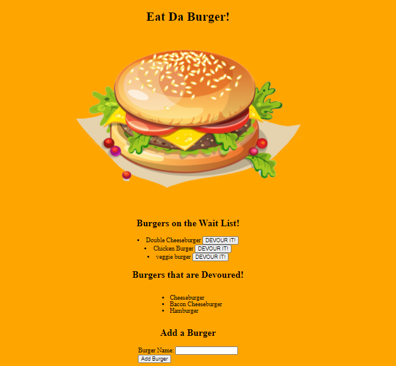

# Burger

##  Description
This is a burger logger application that will allow the user to input the name of a burger they would like eat and select a specific burger they would like to 'Devour' by cicking the 'Devour It!' button.  Technologies used: MySQL, Node, Express, Handlebars and ORM.

## Screenshot of Website  

## Github Repository
[burger](https://github.com/sford4186/burger)

## Deployed Site
https://young-headland-34415.herokuapp.com/

